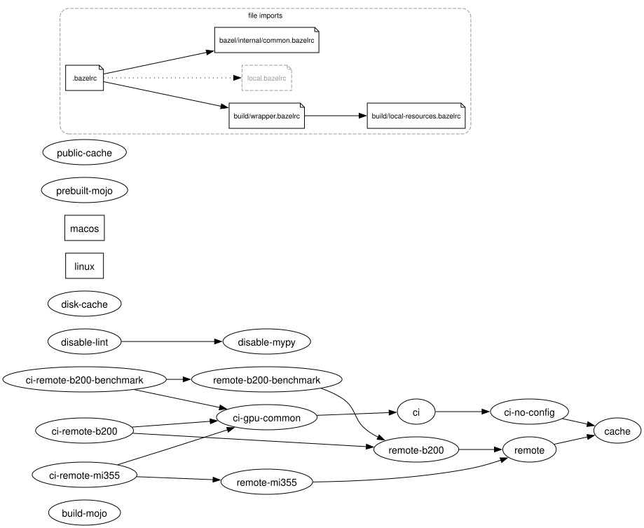

# `bazelrc-graph`

`bazelrc-graph` is a tool for visualizing the `--config` graph of your
`.bazelrc` files using [`graphviz`](https://graphviz.org).

## Usage

```sh
./bazelrc-graph path/to/.bazelrc
```

This writes `bazelrc-graph.dot` and `bazelrc-graph.png` (or an `svg`
with `--svg`) to the current directory (rendering the image requires
`graphviz`'s `dot` on `PATH`).

Example:

[

Automatically open the generated image:

```sh
./bazelrc-graph --open path/to/.bazelrc
```

See the help for more options:

```sh
./bazelrc-graph --help
```
